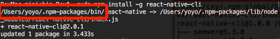
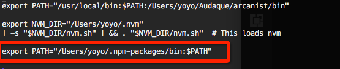

# 整理一些在使用React-Native遇到的问题

### react-native: command not found

描述：sudo npm install -g react-native-cli 或 npm install -g create-react-native-app 安装完成后报错。
原因：环境变量没有配置
解决：
* 找到npm安装react-native-cli的路径，图中红圈。

* 编辑 vim ~/.bash_profile，中加入图中路径，保存。

* 执行source ~/.bash_profile， 使修改生效
* echo $PATH 查看是否添加成功

